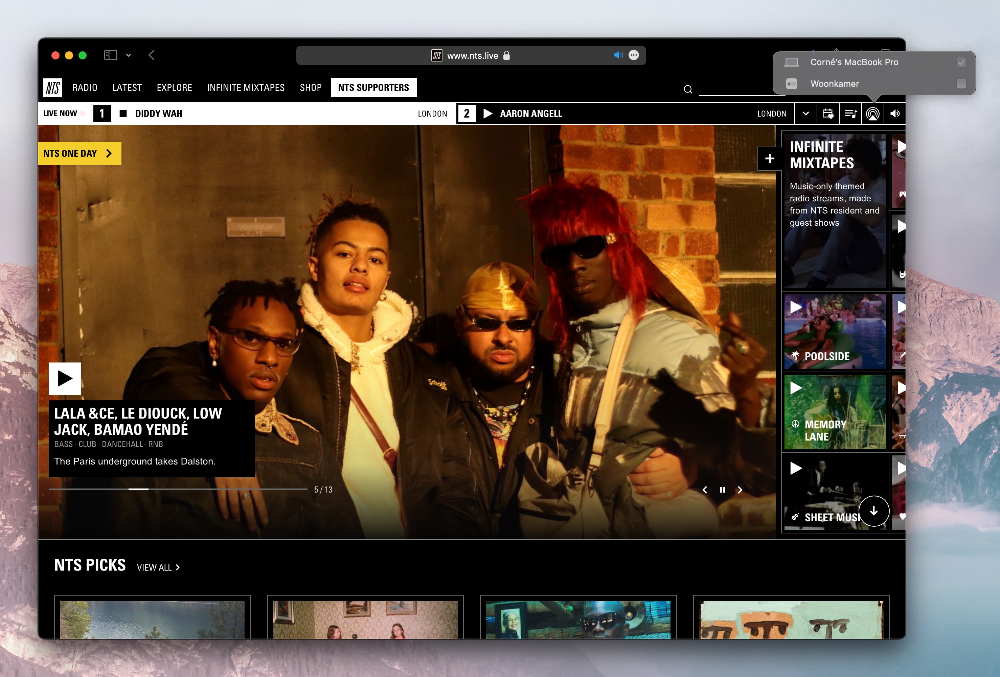

#  AirTS

Enable AirPlay on the NTS.live website using a Safari Extension 

## Getting started

This project is not published to the App Store at the moment. To run this project:

1. Clone and open the project in XCode
2. Press the Run button to start the project.
3. Enable the extension in Safari.

## Contributing

You are welcome to submit any issues or MRs if you have found any issues.

### Getting started

Most of the code is located in [Shared (Extension)/Resources/content.js](https://github.com/cornedor/airts/blob/main/Shared%20(Extension)/Resources/content.js). If you need to make a change, this is probably the place to start.
